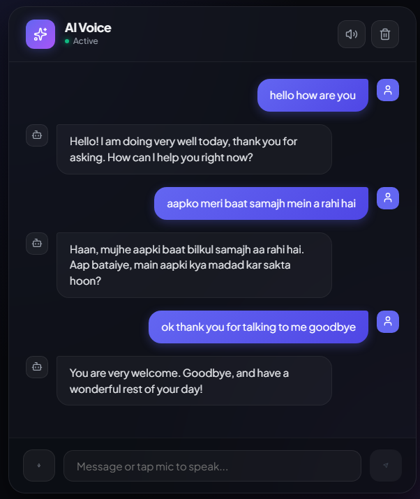

# AI Voice — Hands-Free Voice AI Web Application



AI Voice is a full-stack, voice-first AI web application. Designed for hands-free interactive conversations, it features real-time speech-to-text input, text-to-speech audio feedback, multilingual support, and session-persistent chat memory powered by Google's Gemini API.

---

## Features

- **Hands-Free Conversational Loop:** Automatically re-engages the microphone after the assistant finishes speaking.
- **Multilingual Support:** Seamlessly understands and responds in multiple languages via Gemini's native multilingual context and Web Speech API language models.
- **Natural Goodbye Detection:** Recognizes conversation closure signals (`[END_CONVERSATION]`) to gracefully end the speech loop without reactivating the mic.
- **Session-Based Chat Memory:** Manages backend chat history per session using Gemini's native context window structure.

---

## Tech Stack

- **Frontend:** React, Web Speech API (`webkitSpeechRecognition` & `speechSynthesis`), Lucide Icons
- **Backend:** Python, Flask, Flask-CORS
- **AI Model:** Google Gemini API (`gemini-3.5-flash-lite`)

---

## Project Structure

```text
basic-ai-voice-chatbot/
├── .gitignore
├── README.md
├── images/
│   └── screenshot.png
├── backend/
│   ├── app.py
│   └── venv/
└── frontend/
    ├── src/
    │   ├── App.jsx
    │   └── App.css
    ├── package.json
    └── vite.config.js
```
---

## Getting Started

### Prerequisites

- **Node.js:** v18.0 or higher
- **Python:** 3.9 or higher
- **Gemini API Key:** Obtainable from Google AI Studio

---

### Setup Instructions

#### 1. Backend Setup

Navigate to the `backend` directory and set up your Python environment:

```bash
cd backend

# Create virtual environment
python -m venv venv

# Activate virtual environment
# On macOS/Linux:
source venv/bin/activate
# On Windows:
# venv\Scripts\activate

# Install dependencies from requirements.txt
pip install -r requirements.txt
```

Set your Gemini API key in a .env file inside the backend/ directory:

```bash
GEMINI_API_KEY=your_api_key_here
```

Start the Flask backend server:

```bash
python app.py
```

The backend server will run on `http://localhost:5000`.

---

#### 2. Frontend Setup

Open a new terminal window, navigate to the `frontend` directory, and install the dependencies:

```bash
cd frontend
npm install
```

Start the Vite development server:

```bash
npm run dev
```

Open `http://localhost:5173` in a Chrome or Edge browser (recommended for Web Speech API support).

---

## How It Works

1. **Speech Input:** Click the microphone button to initiate the continuous speech listener.
2. **Backend Processing:** The prompt is sent to `/api/chat`, where Flask appends the input to the current session history and calls `gemini-3.5-flash-lite`.
3. **Audio Synthesis:** The browser synthesizes the response text back to you using `speechSynthesis`.
4. **Loop Management:** If the assistant identifies a goodbye intent, it attaches `[END_CONVERSATION]`. The frontend strips the tag, speaks the farewell, and stops listening. Otherwise, the microphone automatically opens for your follow-up response.